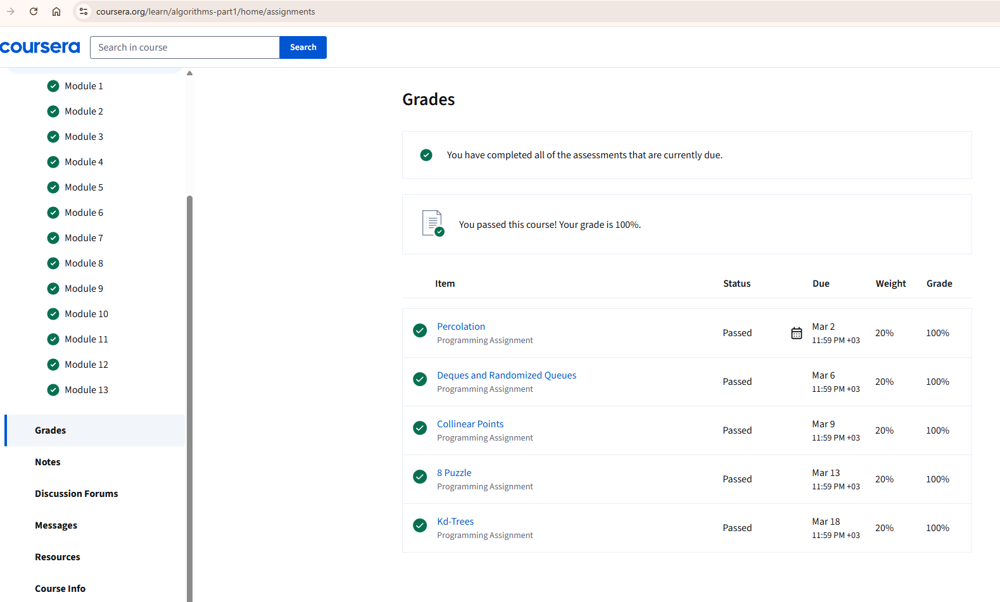

# Algorithms
Algorithms, Part I. Princeton University.
Repository contains my solutions to course.

| Week | Assignment | Score |
| :--- | :--- | :--- |
| **Week 1** | [Percolation](https://github.com/ipototsky/Algorithms/tree/master/src/java/week1) | **101.25%** |
| **Week 2** | [Deques and Randomized Queues](https://github.com/ipototsky/Algorithms/tree/master/src/java/week2) | **100.19%** |
| **Week 3** | [Collinear Points](https://github.com/ipototsky/Algorithms/tree/master/src/java/week3) | **100.00%** |
| **Week 4** | [8 Puzzle](https://github.com/ipototsky/Algorithms/tree/master/src/java/week4) | **100.00%** |
| **Week 5** | [Kd-Trees](https://github.com/ipototsky/Algorithms/tree/master/src/java/week5) | **100.00%** |

